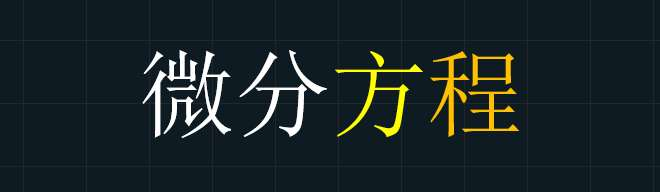

求线性微分方程的解，它的计算量导致计算总是容易出错。因此，能够完美解决线性微分方程的微分算子法才作为一个曲径通幽的方法而存在。它可以大幅降低考研相关题目的求解难度和出错的概率。

**这个神奇的方法，将通过以下目录展开。** 

> catalog：
> 
> 1.什么是微分算子？
> 
> 2.微分算子法解线性微分方程大致思路
> 
> 3.微分算子性质
> 
> 4.微分算子法解微分方程详解(7种类型)

## 1.什么是微分算子：

讲算子之前我们先来看看函数相关知识：

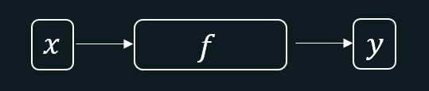

*函数*

如上图，进去一个数，经过某种处理变成另外一个数。进去的数为自变量，出来的数为因变量，而中间的某种处理就是对应法则。用数学表达就是： $y=f(x)$，这就是函数。

那么现在变一下，如果进去的是函数，出来的也是函数呢？如下图：

*算子*

可见，函数 $f$经过某种操作就变成了函数 $g$，而算子，就可以理解为使得函数改变的操作。

那么微分算子又是什么呢？微分涉及到导数。也就是说函数$y$经过处理变成了 $y'$，而这种处理就是微分算子，用 $D$来表示，如下图所示：

*微分算子*

我们可以类比函数的表达方式： $D(y)=y'$，简写成： $Dy=y'$，可见 $Dy$代

表对 $y$求一次导。

同理可得： $Dy'=y''$，此时再将 $Dy=y'$代入得： $DDy=y''$。可见，前面两个 $D$的作用效果即是对 $y$求两次导。

由此归纳得：$D^{m}y=y^{(m)}$(这里将 $m$个 $D$相乘记作 $D^{m}$)，此时说明$D^{m}y$的意思是对 $y$求导 $m$次。

注： $Dy$是由$D(y)$简写而来，所以 $D$只对右边的函数作用，不对左边的作用， 例如：$uDv=uD(v)=uv'$

> 同时，由于 $(ay)^{(m)}=ay^{(m)}$, 所以$D^{m}(ay)=aD^{(m)}y$，其中 $a$是常数。从此可以看出 $D$右边的常数可以提取到左边。

**那么如何表示 ** $D^{m}$**呢？** 

由于 $y'=\frac{dy}{dx}=\frac{d}{dx}y$,结合 $Dy=y'$得： $Dy=\frac{d}{dx}y$，最终 $D=\frac{d}{dx}$

同理， $DDy=D^{2}y=y''=\frac{d^{2}}{dx^{2}}y$，最终 $D^{2}=\frac{d^{2}}{dx^{2}}$。
由此类推： $D^{m}=\frac{d^{m}}{dx^{m}}$。

那么如何用微分算子解线性微分方程呢？接着往下看！

## 2.微分算子法解线性微分方程大致思路

首先线性微分方程可以写成：

$y^{(n)}+a_{1}y^{(n-1)}+a_{2}y^{(n-2)}+…+a_{n-1}y'+a_{n}y=f(x)$

用微分算子表示：

$[D^{(n)}+a_{1}D^{(n-1)}+a_{2}D^{(n-2)}+…+a_{n-1}D+a_{n}]y=f(x)$

设 $F(D)=D^{n}+a_{1}D^{n-1}+a_{2}D^{n-2}+…+a_{n-1}D^{}+a_{n}$，即：

$F(D)y=f(x) \rightarrow y=\frac{1}{F(D)}f(x)$，解出来就是对应的 $y$，即是线性方程的一个特解，所以用算子法解微分方程的关键就在于解 $\frac{1}{F(D)}f(x)$，而这就需要了解微分算子的相关性质。

## 3.微分算子性质：

性质比较多，但是我会通过简单的解析带大家辅助理解和记忆。

> 如果时间有限，可以直接记忆，即可用于解题。

**性质1. ** $F(D)=D^{m}$时， $\frac{1}{F(D)}f^{(m)}(x)=f(x)$

**解析** ：

> 之前所讲 $Dy$可以看成对 $y$求导，即 $Dy=y'$。左右同时"除以" $D$，得： $y=\frac{1}{D}y'$，由此可见 $\frac{1}{D}y$可以看成对 $y$积分。
> 
> 同时， $D^{m}f(x)=f^{(m)}(x)$，左右同时"除以" $D^{m}$即得性质： $f(x)=\frac{1}{D^{m}}f^{(m)}(x)$
> 
> P.S.这也可以说明 $\frac{1}{D^{m}}f(x)$是对 $f(x)$积分 $m$次。

**例题：** 

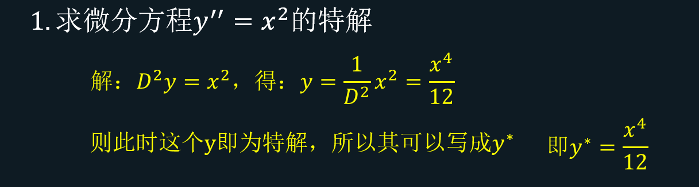

*T01*

> p.s.这里因为是求特解，所以积分时不用考虑出现的常数 $c$。

**性质2. 若** $F(D)=D-k$，$\frac{1}{F(D)}e^{bx}=\frac{1}{b-k}e^{bx}(b\ne k)$

**解析：** 

> 构造微分方程： $y'-ky=e^{bx},(b\ne k)$,我们按照正常的做法，特解可以设为： $y^{*}=me^{bx}$，带入方程，待定系数法解出m： $mbe^{bx}-kme^{bx}=e^{bx} \rightarrow mb-mk=1$，得 $m=\frac{1}{b-k}$，所以特解为：
> 
> $y^{*}=\frac{1}{b-k}e^{bx}$.
> 
> 再用微分算子法解： $y'-ky=e^{bx} \rightarrow Dy-ky=e^{bx}\rightarrow (D-k)y=e^{bx}$得：
> 
> $y^{*}=\frac{1}{D-k}e^{bx}$对比一下即得： $\frac{1}{D-k}e^{bx}=\frac{1}{b-k}e^{bx}$

**性质3. ** 若$F(D)=D^{2}-(a+b)D+ab=(D-b)(D-a)$，则 $\frac{1}{F(D)}f(x)=\frac{1}{D-b}\frac{1}{D-a}f(x)$

**解析：** 

> 构造微分方程： $y''-(a+b)y'+aby=f(x)$,运用微分算子得：
> 
> $D^{2}y-(a+b)Dy+aby=f(x) \rightarrow (D^{2}-(a+b)D+ab)y=f(x)$
> 
> 即得： $y=\frac{1}{D^{2}-(a+b)D+ab}f(x)$……1
> 
> 另一方面， $y''-(a+b)y'+aby=f(x) \rightarrow (y'-by)'-a(y'-by)=f(x)$
> 
> 即为： $D(y'-by)-a(y'-by)=f(x)$,得： $y'-by=\frac{1}{D-a}f(x)$
> 
> 而 $y'-by=Dy-by=(D-b)y$,最终有： $y=\frac{1}{D-b}\frac{1}{D-a}f(x)$，其与1式联立即可得上述性质。

P.S.同理可证 $\frac{1}{D^{2}-(a+b)D+ab}f(x)=\frac{1}{D-a}\frac{1}{D-b}f(x)$

**性质4*.** $\frac{1}{F(D)}e^{kx}=\frac{1}{F(k)}e^{kx}$，其中： $F(k)\ne0$

**解析：** 

> 结合性质2，3简单说明一下：
> 
> 令性质3解析中微分方程的 $f(x)=e^{kx}$，则 $y^{*}=\frac{1}{D^{2}-(a+b)D+ab}e^{kx}=\frac{1}{D-b}\frac{1}{D-a}e^{kx}$，由于 $F(k)\ne0$，所以 $k\ne a,k\ne b$，再根据性质2， $\frac{1}{D-b}\frac{1}{D-a}=\frac{1}{D-b}\frac{1}{k-a}e^{kx}=\frac{1}{k-a}\frac{1}{D-b}e^{kx}=\frac{1}{k-a}\frac{1}{k-b}e^{kx}$
> 
> 注：这里由于 $\frac{1}{k-a}$是常数所以可以提到左边。

此时 $F(D)=D^{2}-(a+b)D+ab$

> 所以 $(k-a)(k-b)=k^{2}-(a+b)k+ab=F(k)$，即有性质4

**例题：** 

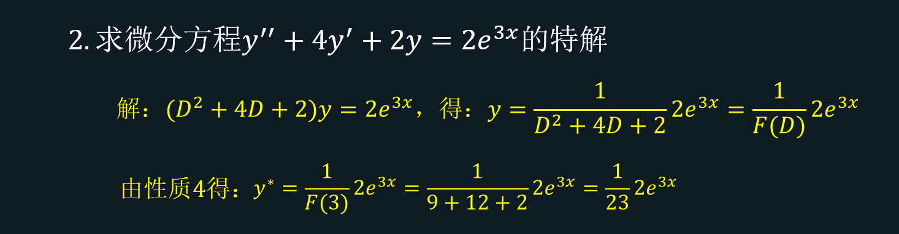

*T02*

**性质5*.** $\frac{1}{F(D)}u(x)e^{kx}=e^{kx}\frac{1}{F(D+k)}u(x)$

> **注：仅有 ** $e^{kx}$**可以提到左边， ** $u(x)$**不行** 

**解析：** 

> 构造微分方程： $y''-(a+b)y'+aby=u(x)e^{kx}$,运用微分算子得：
> 
> $y=\frac{1}{D^{2}-(a+b)D+ab}u(x)e^{kx}$
> 
> 另一方面，变形微分方程 $[y''-(a+b)y'+aby]e^{-kx}=u(x)$得：
> 
> $y''e^{-kx}-(a+b)y'e^{-kx}+abye^{-kx}=u(x)$，令$ye^{-kx}=v$，转化为：
> 
> $[D^{2}+(2k-a-b)D+(k^{2}-ak-bk+ab)]v=u(x)$,整理一下得：
> 
> $[(D+k)^{2}-(a+b)(D+k)+ab]v=u(x) $,解出：
> 
> $v=\frac{1}{(D+k)^{2}-(a+b)(D+k)+ab}u(x)$， 再代入$ye^{-kx}=v$，表示成 $y$
> 
> $y=e^{kx}\frac{1}{(D+k)^{2}-(a+b)(D+k)+ab}u(x)$，最后即有上面的性质。

**例题：** 

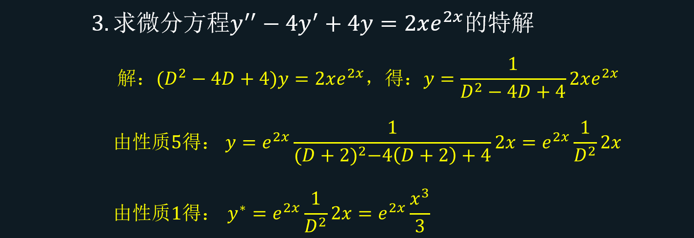

*T03*

**性质6.** $\frac{1}{F(D)}[f_{1}(x)+f_{2}(x)]=\frac{1}{F(D)}f_{1}(x)+\frac{1}{F(D)}f_{2}(x)$

**解析：** 

> 构造微分方程： $y''+ay'+cy=f_{1}(x)$…(1)与$y''+ay'+cy=f_{2}(x)$…(2)
> 
> 通过方程(1)解出来 $y_{1}=$$\frac{1}{F(D)}f_{1}(x)$，方程(2)解出来 $y_{2}=\frac{1}{F(D)}f_{2}(x)$
> 
> 其中 $F(D)=D^{2}+aD+c$。将 $y_{1},y_{2}$代入代入方程为：
> 
> $y_{1}''+ay_{1}'+cy_{1}=f_{1}(x)$和 $y_{2}''+ay_{2}'+cy_{2}=f_{2}(x)$
> 
> 两个相加为： $(y_{1}+y_{2})''+a(y_{1}+y_{2})'+c(y_{1}+y_{2})=f_{1}(x)+f_{2}(x)$,可见 
> 
> $y_{1}+y_{2}$为方程： $y''+ay'+cy=f_{1}(x)+f_{2}(x)$的解，而其解用微分算子表示：
> 
> $y=\frac{1}{F(D)}[f_{1}(x)+f_{2}(x)]$,从而有： $y_{1}+y_{2}=\frac{1}{F(D)}[f_{1}(x)+f_{2}(x)]$
> 
> 最后将 $y_{1},y_{2}$表达式代入即可得到该性质。

**性质7*.** 若$F(D)=D-k$，则 $\frac{1}{F(D)}x^{a}=(-\frac{1}{k}-\frac{D}{k^{2}}-…-\frac{D^{a}}{k^{a+1}})x^{a}$

> **这个公式要记住** 

**解析：** 

> 先找满足 $Q(D)\cdot F(D)=1$的$Q(D)$，怎么求？我们来一项一项的看 $Q(D)$：
> 
> 第一项： $(-k+D)(-\frac{1}{k})=1-\frac{D}{k}$，发现多了一个 $-\frac{D}{k}$，需要第二项去除它
> 
> 第二项： $(-k+D)(-\frac{D}{k^{2}})=\frac{D}{k}-\frac{D^{2}}{k^{2}}$,发现又多了一个 $-\frac{D^{2}}{k^{2}}$，第三项去除它
> 
> 最终以此类推得到了： 
> 
> $Q(D)=-\frac{1}{k}-\frac{D}{k^{2}}-…-\frac{D^{a}}{k^{a+1}}-\frac{D^{a+1}}{k^{a+2}}…$
> 
> 所以有： $\frac{1}{F(D)}x^{a}=Q(D)x^{a}=[-\frac{1}{k}-\frac{D}{k^{2}}-…-\frac{D^{a}}{k^{a+1}}-\frac{D^{a+1}}{k^{a+2}}…]x^{a}$
> 
> 注意：式子中 $Q(D)$里面 $\frac{D^{a}}{k^{a+1}}$后面的项均可不看，因为$x^{a}$求导 $a+1$次之后为0，所以其后面的项与 $x^{a}$结合结果为0。到此即有性质7。

**接下来就可以利用这些性质解题了。** 

## 4.微分算子法解微分方程详解

本文在讲解微分方程大致思路时(第2点)，提到的关键就是处理 $\frac{1}{F(D)}f(x)$，而这对于不同的 $f(x)$，解法也不同，因此接下来围绕不同类型的 $f(x)$来讲解。

**类型一：微分方程右边的函数** $f(x)=x^{a}$**时：** 

此时我们的特解即为： $y^{*}=\frac{1}{F(D)}x^{a}$，此时可以利用**性质1，3，7** 来解决，例题如下：

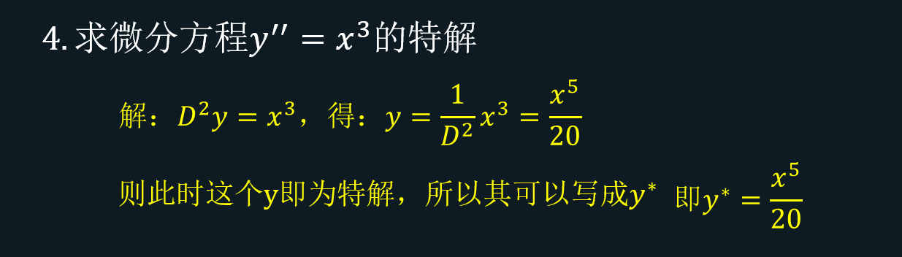

*T04*

本题利用性质1解决，一步到位！

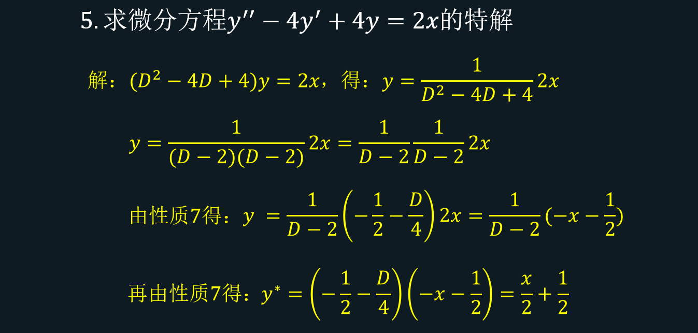

*T05*

利用性质3将 $F(D)$拆分，然后使用两次性质7即可解决本题

> p.s.这种情况用原始方法更快，这里用算子法是让大家熟悉一下，为后面做准备。

**类型二：微分方程右边的函数 ** $f(x)=e^{bx}$**时：** 

此时我们的特解即为： $y^{*}=\frac{1}{F(D)}e^{bx}$，根据 $b$的情况来确定用哪些性质：

**a. ** $F(b)\ne 0$**时：** 

直接用**性质4** 搞定

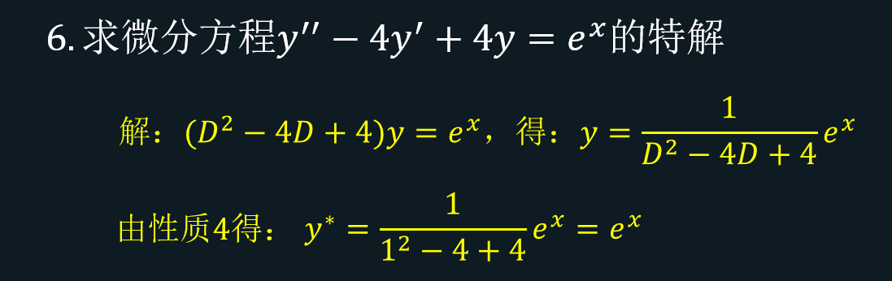

*T06*

**b.** $F(b)=0$**时：** 

先用**性质5** 转变为： $\frac{1}{F(D)}e^{bx}=e^{bx}\frac{1}{F(D+b)}1$，然后只需解出 $\frac{1}{F(D+b)}1$即可，而其可看成是 $\frac{1}{F(D+b)}x^{0}$，这样就可以按照**类型一** 的解法来了。

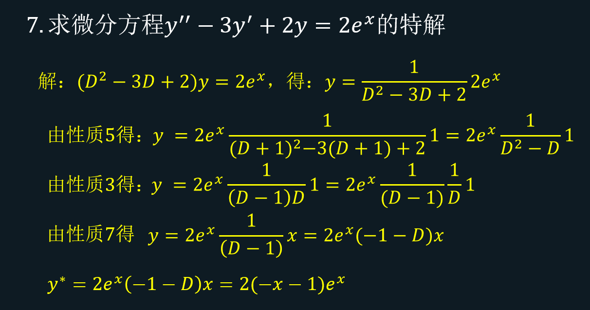

*T07*

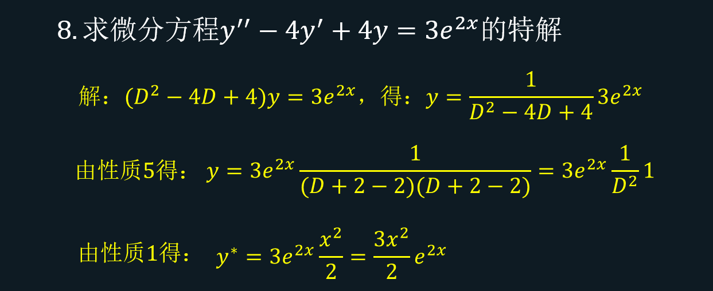

*T08*

**类型三：微分方程右边的函数 ** $f(x)=x^{a}e^{bx}$**时：** 

先用性质5转变为： $\frac{1}{F(D)}x^{a}e^{bx}=e^{bx}\frac{1}{F(D+b)}x^{a}$，然后只需解出 $\frac{1}{F(D+b)}x^{a}$

即可，这样就可以按照**类型一** 的解法。

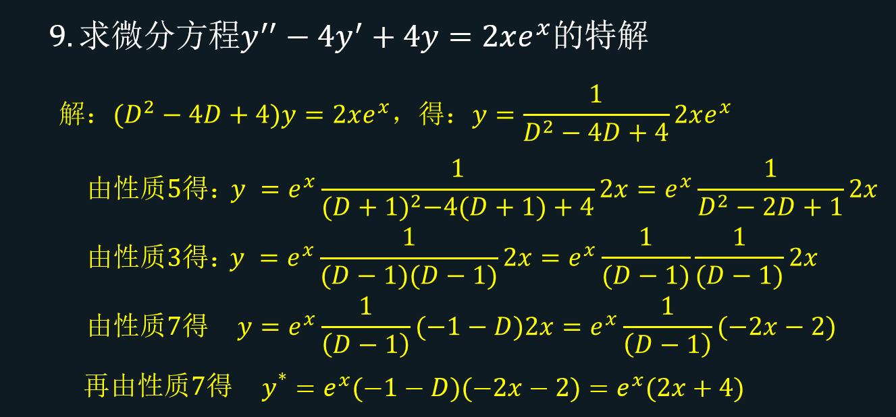

*T09*

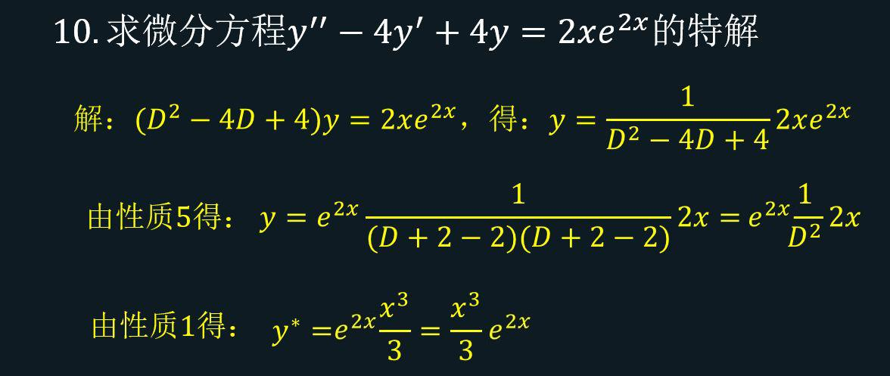

*T10*

**类型四：微分方程右边的函数 ** $f(x)=sinbx$**或者 ** $f(x)=cosbx$**时：** 

> 此时需要再记住一个公式： $e^{bxi}=cosbx+isinbx$，其中 $i^{2}=-1$

这样就有这种类型的做法了，首先将$\frac{1}{F(D)}f(x)$转变为 $\frac{1}{F(D)}e^{bxi}$，之后再按照类型2做。做到最后，再利用上述公式把结果中的 $e^{bxi}$转化为 $cosbx+isinbx$，然后取最后式子的实部或者虚部就是该方程的解。当 $f(x)=sinbx$则取虚部，当$f(x)=cosbx$则取实部。

此时也分为两种情况，第一种 $F(bi)\ne 0$：此时需运用性质4，如下：

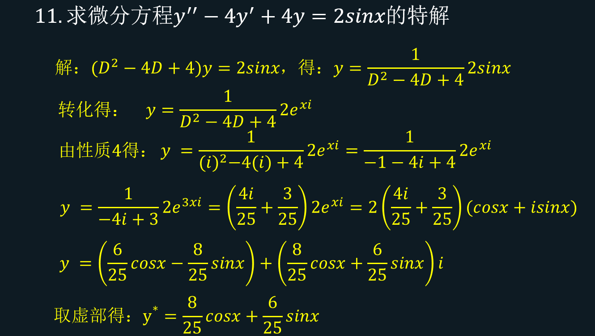

*T11*

第二种 $F(bi)= 0$：此时利用性质5转变为： $\frac{1}{F(D)}e^{bix}=e^{bix}\frac{1}{F(D+bi)}$，然后只需解出 $\frac{1}{F(D+bi)}$即可，如下：

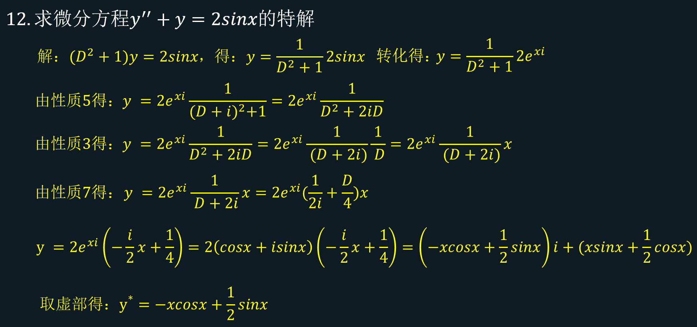

*T12*

**类型五：微分方程右边的函数 ** $f(x)=x^{a}sinbx$**或者 ** $f(x)=x^{a}cosbx$**时：** 

利用性质5转变为： $\frac{1}{F(D)}x^{a}e^{bix}=e^{bix}\frac{1}{F(D+bi)}x^{a}$，然后只需解出 $\frac{1}{F(D+bi)}x^{a}$即可，方法大致和**类型四中第二种情况** 一样，如下：

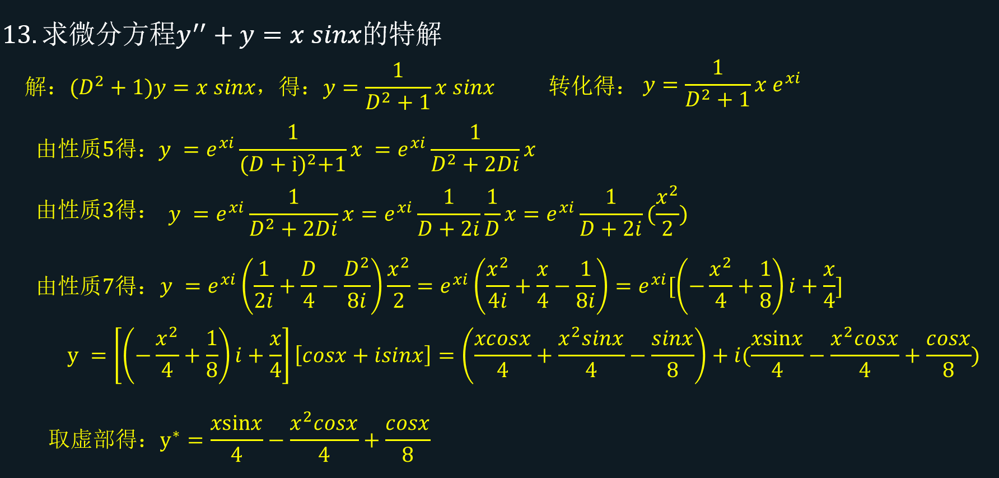

*T13*

**类型六：微分方程右边的函数 ** $f(x)=e^{ax}sinbx$**或者 ** $f(x)=e^{ax}cosbx$**时：** 

思路和第四类差不多，先将$\frac{1}{F(D)}f(x)$转变为 $\frac{1}{F(D)}e^{(a+bi)x}$,之后按照第四类一样的套路，如下：

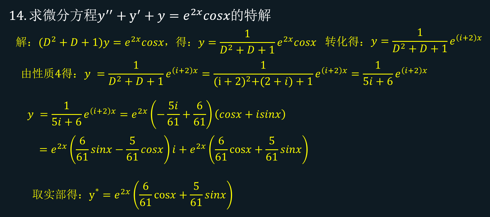

*T14*

**类型七：微分方程右边的函数 ** $f(x)$**为上述若干情况之和：** 

此时运用性质6，将其拆开之后各自运算，最后相加即可，如下：

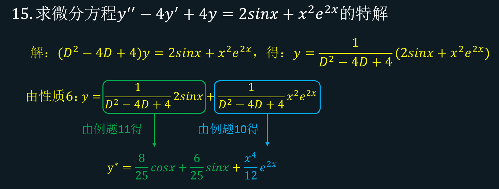

*T15*

## 注：本文举的例子以二阶线性微分方程为主，其他更高阶的线性微分方程做法差不多，大家可以自行类比。

## 到此结束~

## 我是煜神学长，考研我们一起加油！！！

## 往期总结笔记：

[煜神学长：148分学长考研数学结论总结（秒杀函数、极限与连续-第1期）](https://zhuanlan.zhihu.com/p/375227614)

[煜神学长：148分学长考研数学结论总结（秒杀函数、极限与连续-第2期）](https://zhuanlan.zhihu.com/p/377405836)

[煜神学长：148分学长考研数学结论笔记-导数与微分解题技巧（第3期）](https://zhuanlan.zhihu.com/p/380382427)

[煜神学长：148分学长考研数学结论笔记-一元函数积分学解题技巧总结（第四期）](https://zhuanlan.zhihu.com/p/385667232)

[煜神学长：148分学长考研数学结论笔记-多元函数微分学解题技巧总结（第五期）](https://zhuanlan.zhihu.com/p/397416460)

## 其他干货文章：

[煜神学长：正交变换最强总结笔记，解决每一个考研线代人的理解难关](https://zhuanlan.zhihu.com/p/382012427)

[煜神学长：超强换元法，二重积分计算的核武器！（雅可比行列式超通俗讲解）](https://zhuanlan.zhihu.com/p/382301310)

[煜神学长：高数极限概念题，90%的人都会做错的一道题](https://zhuanlan.zhihu.com/p/384403264)

[煜神学长：考研秘技-拉格朗日中值定理横扫极限难题！(秒杀5种题型)](https://zhuanlan.zhihu.com/p/378603798)

[煜神学长：一文搞懂考研数列极限问题(概念/计算/证明)史上最强/最全总结！！](https://zhuanlan.zhihu.com/p/355238774)

[煜神学长：多元函数微分学条件极值(拉格朗日乘数法)求解技巧总结](https://zhuanlan.zhihu.com/p/399975884)

[煜神学长：一文彻底搞懂积分等式证明题(积分证明题总结笔记1/3)](https://zhuanlan.zhihu.com/p/407778580)

[煜神学长：一文搞懂由积分判断函数零点个数问题(积分证明题总结笔记2/3)](https://zhuanlan.zhihu.com/p/408967560)

[煜神学长：一文搞懂积分不等式证明(积分证明题总结笔记3/3)](https://zhuanlan.zhihu.com/p/411078530)

[煜神学长：分部积分题型总结笔记（分部积分超强拓展）](https://zhuanlan.zhihu.com/p/420792593)

[煜神学长：考研变限积分概念超详细，超通俗讲解（变限积分和原函数关系）](https://zhuanlan.zhihu.com/p/425569861)

[煜神学长：变限积分相关题型笔记总结（概念+计算）](https://zhuanlan.zhihu.com/p/423768372)

