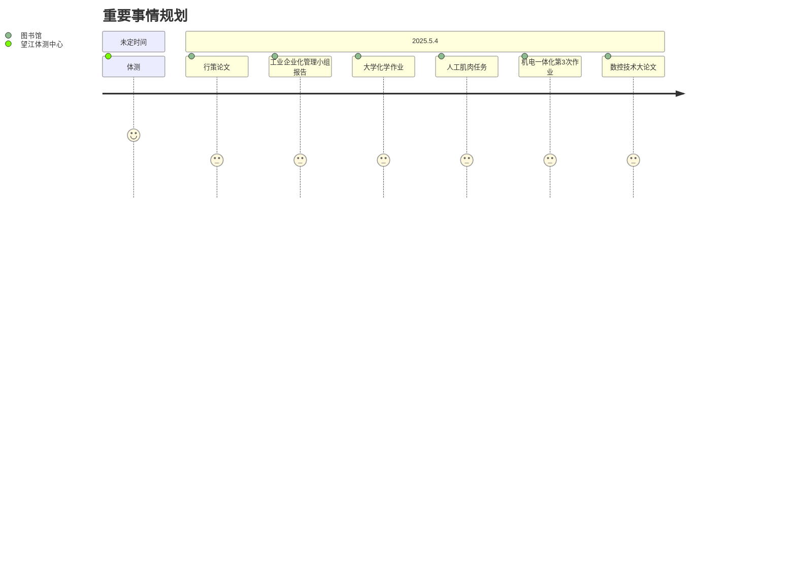

# 从现在开始, 全心全意投入到11408中, 开始408的学习

- 先是太胆小, 明知不该做的事却不敢做; 后来也还是太胆小, 明知该做的事却不敢去做.
- 当别人的行为让你烦躁时，立即问自己： “这会影响我的长期目标吗？” “我能改变这个事实吗？” “现在做什么最能保护我的时间？” 

| 任务        | 目的                           | 当下的重要程度 |
| --------- | ---------------------------- | ------- |
| 数学        | 考研                           | 重要      |
| 数据结构 / 算法 | 考研                           | 重要      |
| kaggle    | 研究生复试的项目                     | 一般      |
| 数模        | 用于学习 matlab 和算法, 也是想拿来做复试的谈资 | 一般      |

- [ ] 每周要抽出 6-8 小时给机器学习
- [ ] 开始蓝桥杯的 c ++ 算法, 后续要转向 letcode
- [ ] 结束线代的内容, 开始线代的刷题
- [ ] 养成锻炼的习惯
- [ ] 后续要做的事情围绕着考研和数模展开

> [!info]
> 考研：
> - [ ] c
> - [ ] 蓝桥杯 c ++, ac-wings, B 站的算法
> - [ ] 数据结构
> - [ ] 线性代数
> - [ ] 英语单词习惯
> 
> 数模：
> - [ ] python 数学建模 书
> - [ ] python 数据分析 书
> - [ ] 深度学习 梭哈鼓泡
> - [ ] 路飞数据分析 (这里仅用于引入, 这个资料不是特别好)
> - [ ] 清风数学建模 主要
> - [ ] Matlab 数学建模
 
 # 作业
 
- 网络化制造技术
	- 作业
- 数值分析和优化算法
	- 实验报告
- 机械制造工程学
	- mooc 刷视频, 做练习
- 数控综合实验
	- 还差2个实验报告, 还有4个实验报告要手写内容, 需要提前搜集好答案
	- 前面的实验报告可以重新打印, 之前的太不清晰了
- 机电一体化系统设计 
	- 小论文和专题讨论, 清明节把机电的作业做了
		![[规划.md_Attachments/mmexport1741222407117.jpg|400]]
		![[规划.md_Attachments/mmexport1741222409072 1.jpg|400]]
## 笔记
[[../002_学习/数据结构/数据结构|数据结构]]
[[../002_学习/线性代数/线性代数|线性代数]]
## 重要事情备忘录

## 今日任务

> [!info]
> 从3.29号开始, 正式进入考研备战阶段.
> 
> 数学建模 和 kaggle 不需要投入太多的时间, 当做饭后甜点
> 
> 需要重点投入的是 `考研` 和 `算法`
--- 

 ```mermaid
kanban
[上午]
[下午]
  	[喝咖啡]
    [看一集强风吹拂]
    [微积分的定积分和运用,
     傅里叶级数, 多重积分]
    [英语单词]
    [计组看第2章, 
    能看多少看多少]
[晚上]
  	[9点收工]
  	[回来洗澡, 
  	手上记得擦药]
  	[去跑步,
  	今日不许熬夜]
```
## 日记
#### 5.3
好久没有写过反思了, 说下最直接的问题, 没有锻炼, 一直在逃避; 

最近两天吃烧烤, 去外面吃面, 花费了很多钱, 然后每天喝可乐, 属[]()于暴饮暴食, 这是错误的消遣方式;

每天晚上都刷抖音熬夜, 最早睡觉时间是1.00, 最晚是3.00左右, 在这种情况下, 是不可能养成早起, 锻炼和正常生活的锻炼习惯.

反思是解决问题的开始, 考研是长期战, 不要为了一时的得与失, 忽略了长期的收益.
## sz 播放器密码

| 视频          | 账号      | 密码  | 解压密码 |
| ----------- | ------- | --- | ---- |
| 慕课 ai       | gg00448 | 123 | szjm |
| 路飞 python   | gg00563 | 123 | szjm |
| 咕泡人工        | gg00644 | 123 | zzcq |
| 路飞 pthon 数据 | zz5588  | 123 | szjm |
## Python 小屋账号

| 账号            | 密码     | 姓名  |
| ------------- | ------ | --- |
| P202503131707 | 123456 | 宋天佑 |
|               |        |     |
# 周目标
## 第8周( 4.14 - 4.20)
- [ ] 结束数据结构
- [ ] 微积分做题做完微分方程
## 第5周 ( 3.24 - 3.30 )
- [ ] 搞定 c 语言中级
- [ ] 开始算法学习
- [ ] 养成每天锻炼的习惯
- [ ] 开始微积分学习
- [x] 结束线代知识内容
## 第3周 ( 3.10 - 3.16 )
- [ ] 搞定 c 语言中级
- [x] 养成早起, 背单词, 运动的习惯
- [x] 线代搞完两章
- [ ] 后续要做的事情围绕着考研和数模展开