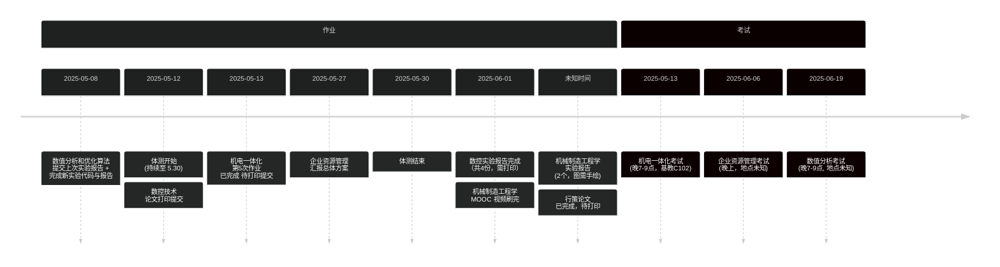
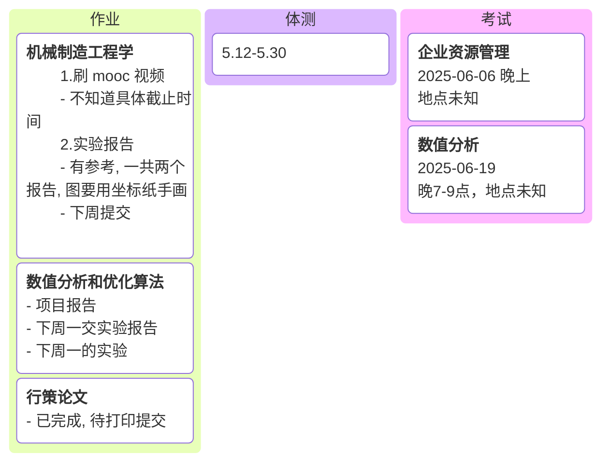
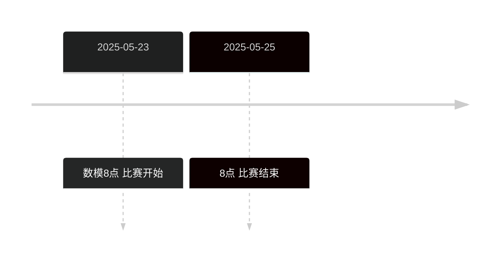

# 从现在开始, 全心全意投入到11408中, 开始408的学习

- 先是太胆小, 明知不该做的事却不敢做; 后来也还是太胆小, 明知该做的事却不敢去做.
- 当别人的行为让你烦躁时，立即问自己： “这会影响我的长期目标吗？” “我能改变这个事实吗？” “现在做什么最能保护我的时间？” 

| 任务        | 目的                           | 当下的重要程度 |
| --------- | ---------------------------- | ------- |
| 数学        | 考研                           | 重要      |
| 数据结构 / 算法 | 考研                           | 重要      |
| kaggle    | 研究生复试的项目                     | 一般      |
| 数模        | 用于学习 matlab 和算法, 也是想拿来做复试的谈资 | 一般      |


> [!info]
> 数模：
> - [ ] 深度学习 梭哈鼓泡
> - [ ] 清风数学建模 主要
> - [ ] Matlab 数学建模

## 重要事情备忘录
- [ ] 机械制造工程学的实验报告需要改下公式, 还要问下, 哪里要手写, 哪里要打印
- [ ] 数控实验问清楚哪里要手写, 还要把3, 4的图片搜集好




## 今日任务

> [!info]
> 从3.29号开始, 正式进入考研备战阶段.
> 
> 需要重点投入的是 `考研` 和 `算法`
--- 



 ```mermaid
kanban
[下午]
	[英语单词]
	[概统第4章]
[晚上]
	[吃晚饭]
	[洗澡]
	[购买Axmath]
	[安装好stata]
```
## 日记
#### 5.3
好久没有写过反思了, 说下最直接的问题, 没有锻炼, 一直在逃避; 

最近两天吃烧烤, 去外面吃面, 花费了很多钱, 然后每天喝可乐, 属暴饮暴食, 这是错误的消遣方式;

每天晚上都刷抖音熬夜, 最早睡觉时间是1.00, 最晚是3.00左右, 在这种情况下, 是不可能养成早起, 锻炼和正常生活的锻炼习惯.

反思是解决问题的开始, 考研是长期战, 不要为了一时的得与失, 忽略了长期的收益.
## sz 播放器密码

| 视频          | 账号      | 密码  | 解压密码 |
| ----------- | ------- | --- | ---- |
| 慕课 ai       | gg00448 | 123 | szjm |
| 路飞 python   | gg00563 | 123 | szjm |
| 咕泡人工        | gg00644 | 123 | zzcq |
| 路飞 pthon 数据 | zz5588  | 123 | szjm |
## Python 小屋账号

| 账号            | 密码     | 姓名  |
| ------------- | ------ | --- |
| P202503131707 | 123456 | 宋天佑 |
|               |        |     |
# 周目标
## 第12周( 5.12 - 5.18 )
- [ ] 结束计算机组成
- [ ] 结束概率统计, 开始强化
- [ ] 单词开始做一次题
## 第8周( 4.14 - 4.20)
- [ ] 结束数据结构
- [ ] 微积分做题做完微分方程
## 第5周 ( 3.24 - 3.30 )
- [ ] 搞定 c 语言中级
- [ ] 开始算法学习
- [ ] 养成每天锻炼的习惯
- [ ] 开始微积分学习
- [x] 结束线代知识内容
## 第3周 ( 3.10 - 3.16 )
- [ ] 搞定 c 语言中级
- [x] 养成早起, 背单词, 运动的习惯
- [x] 线代搞完两章
- [ ] 后续要做的事情围绕着考研和数模展开