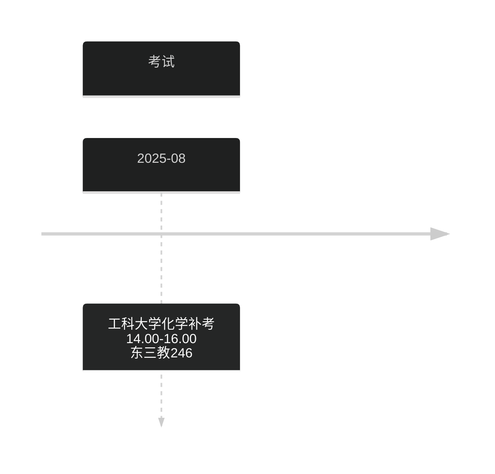

# 专心投入到自己的未来中

## 今日任务
> [!info]
> 从3.29号开始, 正式进入考研备战阶段.
> 
> 需要重点投入的是 `考研` 和 `算法`
--- 

少说空话, 多做事实, 既然畏惧未来会失败, 为什么不现在去自律, 投入对自己人生有益的事情? 不要让将来的自己后悔, 也不要让现在的自己糊涂下去

待会学习完后也要看书, 留出1个小时去看<把时间当作朋友>
- [ ] 上厕所
- [ ] 6点洗澡, 洗衣服, 洗袜子, 换袜子
- [ ] 买纸巾
- [ ] 做计组第2章, 不懂看视频
- [ ] 看操作系统
- [ ] 看数学
- [x] 现在看书
- [x] 导入两本书, 一本是被讨厌的勇气, 一本是把时间当做朋友
## 日记
#### 5.3
好久没有写过反思了, 说下最直接的问题, 没有锻炼, 一直在逃避; 

最近两天吃烧烤, 去外面吃面, 花费了很多钱, 然后每天喝可乐, 属暴饮暴食, 这是错误的消遣方式;

每天晚上都刷抖音熬夜, 最早睡觉时间是1.00, 最晚是3.00左右, 在这种情况下, 是不可能养成早起, 锻炼和正常生活的锻炼习惯.

反思是解决问题的开始, 考研是长期战, 不要为了一时的得与失, 忽略了长期的收益.
## sz 播放器密码

| 视频          | 账号      | 密码  | 解压密码 |
| ----------- | ------- | --- | ---- |
| 慕课 ai       | gg00448 | 123 | szjm |
| 路飞 python   | gg00563 | 123 | szjm |
| 咕泡人工        | gg00644 | 123 | zzcq |
| 路飞 pthon 数据 | zz5588  | 123 | szjm |
## Python 小屋账号

| 账号            | 密码     | 姓名  |
| ------------- | ------ | --- |
| P202503131707 | 123456 | 宋天佑 |
|               |        |     |
# 周目标
## 第12周( 5.12 - 5.18 )
- [ ] 结束计算机组成
- [ ] 结束概率统计, 开始强化
- [ ] 单词开始做一次题
## 第8周( 4.14 - 4.20)
- [ ] 结束数据结构
- [ ] 微积分做题做完微分方程
## 第5周 ( 3.24 - 3.30 )
- [x] 搞定 c 语言中级
- [x] 开始算法学习
- [ ] 养成每天锻炼的习惯
- [x] 开始微积分学习
- [x] 结束线代知识内容
## 第3周 ( 3.10 - 3.16 )
- [x] 搞定 c 语言中级
- [x] 养成早起, 背单词, 运动的习惯
- [x] 线代搞完两章
- [x] 后续要做的事情围绕着考研和数模展开