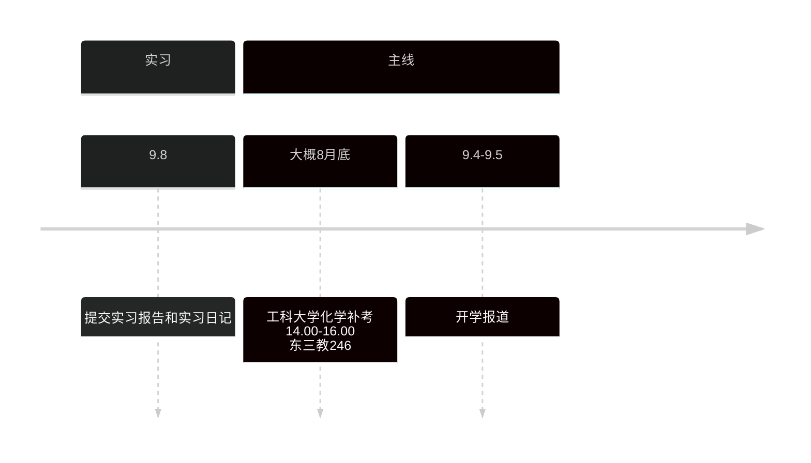

# 专心投入到自己的未来中

## 今日任务
> [!info]
> 从3.29号开始, 正式进入考研备战阶段.
> 
> 需要重点投入的是 `考研` 和 `算法`
--- 

少说空话, 多做事实, 既然畏惧未来会失败, 为什么不现在去自律, 投入对自己人生有益的事情? 不要让将来的自己后悔, 也不要让现在的自己糊涂下去.

- [x] 早起
- [x] os改错, 做笔记
- [x] 单词
- [x] 补语法
> 语法以后每天4day, 目前进度8day, 剩余40day, 预计还有10天, 后续可以加把力
- [x] 数学改错,数学笔记用word文件
- [x] 刷数学题, 30-40题
- [ ] 数学改错
- [ ] 明天开始看完上册的强化, 然后后面就是一直做到86页,也就是完成上册的强化, 目前的进度太慢了, 争取这个月过完660, 非常困难, 争取花一个月的时间做完660, 后面花1个越的时间做完330, 要批核看视频
- [ ] 继续os的2,3章节
> os先暂停, 先把机组重新过一遍, 选择题全部做完, 预计花费一周时间, 然后继续os和计网

## 日记
### 2025-7-14-22:26 四川成都 工科图书馆
目前感觉很难受, 主要是今晚660进度受阻, 发现好多题不会做.

- 今天660做了20题, 还有错题遗留, 明天开始
- 英语这次做了5day的语法, 目前为了追进度, 每天要进行8d-10d的语法练习, 尽快结束.
- 今天os留的时间很少, os第二章看了之后, 发现需要计组的存储器前置知识
	- 我现在的思路是先重新过一遍机组, 优先看湖科大的, 湖科大计组没有的内容看b姐的.
	- 明天开始, 把王道第2,3章对应的湖科大内容看完, 然后做完2, 3章全部题目,然后看os第2章, 也要做完题目

把英语语法刷完后, 买田静和唐迟的资料, 提前购买政治资料

目前7月份来看的任务
- 英语单词常态化,7月底追上田静的每日一练习, 追上进度后, 8月初开始刷英语题
- 微积分过完一轮强化, 660尽可能的做, 目前来看肯定是做不完
- os和计组真正的学懂, 做完题, 然后开始计网.

也就是目前来看, 要8月中旬结束我们408的一轮, 尽量结束高数强化.

8月份就是做完660, 330要做一半.

数据结构的题目二轮要全部做完, 二轮的计组,os和计网看湖科大, b姐, 咸鱼的强化.

9月份要开始政治复习.

整体来看, 任务非常艰巨, 也就是我们要坚持, 要做好长期战的准备, 要有信心, 我们尽自己所能去实现

### 2025-7-9 湖北十堰 东风接待所
日记实际上也是自己和自己最真诚的对话, 如果在日记中, 与自己的沟通中, 都做不到.
在这实习的时间中, 也没学习, 基本上大部分时间都在刷抖音和撸管, 哈哈哈.

一开始撸管是研究了下jable的电影下载, 后面又重拾了和gemini的色情故事创作, 老实说挺有趣的, 然后也挺吸引我的, 毕竟是按自己XP来的, 不过随之而来, 自己也意识到问题, 我极容易沉迷进色情中, 很难自拔, 目前还没有去解决, 可能有初步的想法, 但目前还没去做,

初步设想是, 定好使用的时间段, 其余时间如果有这种类似的想法, 要转移注意力, 也就是要控制好时间.

感觉此行最大的收获, 或则说收获的最大问题是, 和舍友的关系闹僵, 大部分实际来源于自己的的问题, 我非常看不起他, 和此前大一大二的舍友一样, 可能是积怨已久, 之前的直播吵, 健身吵, 也不学习, 也许我是看到了另一个自己, 也许是我看的了更加优秀的人, 可能最大的不满是, 凭什么他能够在期末速通后, 成绩与我不相上下, 也就是我感觉自己被别人比下去了, 还有一层原因可能是他和其他人关系很好.

>  嗯, 这里说下, 尽管说出这些伤疤, 自己会很难受, 但是, 第一要学会抽离情绪, 第二我们只要找准问题后, 才能解决问题. 所以任何时候, 你有改变的能力, 但也要改变的勇气

好, 分析到这里, 实际上问题呼之欲出, 我们此前也总结过, 自己是一个`极度自负`的人, `极度自卑`的人, 再加上自己很容易把和人相处的关系, 处理成`竞争`关系, 在越亲密的关系中, 我越容易陷入`嫉妒`中.

加上自己当前的状态, 不是说没调整好, 而是自己没有勇气去改变, 我就会像一个落魄之人对幸福之人产生嫉妒, 甚至因此生恨.

我现在的解决思路是, 第一, 不要沉迷于人际关系, 这是当前我的缺陷, 在人际关系的交往中, 我容易陷入和他人的比较竞争中, 要么闷闷不乐, 自甘堕落, 要么就是对别人进行打压.

不沉迷于人际关系, 意味着:

`言少`, 不与人过多讨论自己的事情, 也不过多讨论事情, 我是一个做事谈不上坚定的人, 和人讨论上头, 实际上是自己上头, 准确的说自己很容易上头, 上头的时候, 会忘记自己要做什
么, 会拖延, 会推迟, 会逃避现实, 注意力会放在他人身上, 而忘记聚焦于自己.

感觉好像少说话, 就能够解决很多事情, 但少说话是一个结果, 如何达到这个过程是很重要的.

重心要放在自己身上, 自律的话, 我们自己也说过无数遍, 可能要达到这个效果, 不如去慢慢做起来, 我也不想说什么速成考研一说, 安排什么宏伟的目标, 先做起来吧, 先沉迷进去, 先进入状态, 后面再细致的划分也不晚.

### 2025-5-3 四川成都 451寝室
好久没有写过反思了, 说下最直接的问题, 没有锻炼, 一直在逃避; 

最近两天吃烧烤, 去外面吃面, 花费了很多钱, 然后每天喝可乐, 属暴饮暴食, 这是错误的消遣方式;

每天晚上都刷抖音熬夜, 最早睡觉时间是1.00, 最晚是3.00左右, 在这种情况下, 是不可能养成早起, 锻炼和正常生活的锻炼习惯.

反思是解决问题的开始, 考研是长期战, 不要为了一时的得与失, 忽略了长期的收益.
## sz 播放器密码

| 视频          | 账号      | 密码  | 解压密码 |
| ----------- | ------- | --- | ---- |
| 慕课 ai       | gg00448 | 123 | szjm |
| 路飞 python   | gg00563 | 123 | szjm |
| 咕泡人工        | gg00644 | 123 | zzcq |
| 路飞 pthon 数据 | zz5588  | 123 | szjm |
## Python 小屋账号

| 账号            | 密码     | 姓名  |
| ------------- | ------ | --- |
| P202503131707 | 123456 | 宋天佑 |
|               |        |     |
