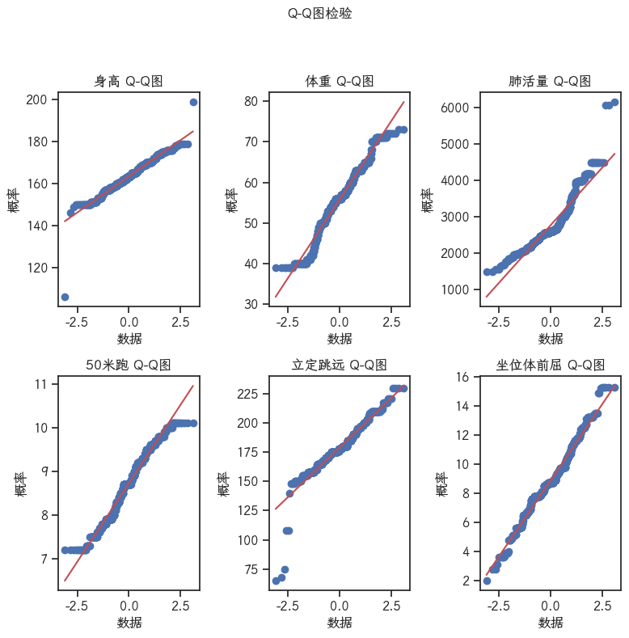

## 数据的相关系数检验流程
常用的统计量显示


```python
import os
import pandas as pd
import numpy as np
import seaborn as sns
import matplotlib.pyplot as plt
from scipy import stats
```

### 读取数据


```python
file_path = r"data/八年级男生体测数据.xls"
df = pd.read_excel(file_path)
r, c = df.values.shape
df.head, c
```


    (<bound method NDFrame.head of       身高  体重   肺活量  50米跑  立定跳远  坐位体前屈
     0    163  63  2073   9.2   208   10.5
     1    158  59  2949   7.5   210    9.8
     2    157  70  2173   8.1   210   10.7
     3    158  59  2949   7.5   210    9.8
     4    157  70  2173   8.1   210   10.7
     ..   ...  ..   ...   ...   ...    ...
     725  169  53  3012   8.0   168    6.5
     726  163  60  3200   9.4   173    6.9
     727  163  51  1980   8.5   187    9.6
     728  150  53  1982   8.6   154    3.6
     729  162  41  2001   9.0   148    4.0
     
     [730 rows x 6 columns]>,
     6)


计算常用统计量


```python


def statistics_array(data: np.ndarray, excle_name="描述性统计"):
    """
    :param data: 多维数组,每列代表各指标, 每行代表各样本
    :param excle_name: 保存的excel名字
    :return: 没有返回, 打印创建好文件以及描述性统计数据
    """

    # 0: 最小值
    # 1: 最大值
    # 2: 平均值
    # 3: 中位数
    # 4: 众数
    # 5: 标准差
    # 6: 峰度
    # 7: 偏度

    root_dir = r"Excel"
    if not os.path.exists(root_dir):
        os.makedirs(root_dir)

    save_path = os.path.join(root_dir, f'{excle_name}.xlsx')

    # 1.先完成统计量的计算, 用np数组保存
    index = ['最小值', '最大值', '平均值', '中位数', '众数', '标准差', '峰度', '偏度']
    columns = ['身高', '体重', '肺活量', '50米跑', '立定跳远', '坐位体前屈']
    _, c = data.shape
    statistics_array = np.zeros((8, c))
    # 最小值
    statistics_array[0, :] = np.min(data, axis=0)
    # 最大值
    statistics_array[1, :] = np.max(data, axis=0)
    # 平均值
    statistics_array[2, :] = np.mean(data, axis=0)
    # 中位数
    statistics_array[3, :] = np.median(data, axis=0)
    # np.quatntile(a,0.5)
    # 众数
    statistics_array[4, :] = stats.mode(data, axis=0)[0]  # 了解api
    # 标注差
    statistics_array[5, :] = np.std(data, axis=0)
    # 峰度
    statistics_array[6, :] = stats.skew(data, axis=0)
    # 偏度
    statistics_array[7, :] = stats.kurtosis(data, axis=0)
    statistics_array = np.round(statistics_array, decimals=5)
    # 保存为DataFrame
    statistics_df = pd.DataFrame(statistics_array, columns=columns, index=index)
    print(statistics_df)
    if not os.path.exists(save_path):
        statistics_df.to_excel(save_path, index=True)
        print(f"{excle_name} 文件下载完成")
    else:
        print(f"{excle_name} 文件已下载, 保存至{save_path}")


statistics_array(df)
```

                身高        体重         肺活量      50米跑       立定跳远     坐位体前屈
    最小值  106.00000  39.00000  1506.00000   7.20000   65.00000   2.00000
    最大值  199.00000  73.00000  6156.00000  10.10000  230.00000  15.30000
    平均值  163.48904  55.82603  2770.35479   8.72438  179.06575   8.89068
    中位数  163.00000  56.00000  2598.00000   8.70000  178.00000   8.70000
    众数   165.00000  56.00000  2600.00000   8.70000  175.00000   8.70000
    标准差    7.05637   7.81401   664.84729   0.72525   17.54731   2.10132
    峰度    -0.58191  -0.25624     1.27268  -0.13836   -0.78428   0.15443
    偏度     5.86441  -0.22699     2.25801  -0.86281    6.04086   0.63113
    描述性统计 文件已下载, 保存至Excel\描述性统计.xlsx
    

### 正态检验

#### Q-Q图


```python
# 设置sns的字体
font_config = {
    'font.family': ['LXGW WenKai GB Screen R', 'JetBrains Mono NL'],
    'font.size': 10,
    "mathtext.fontset": 'stix',
    "font.serif": ['SimSun'],
    "font.sans-serif": 'SimHei',
    'axes.unicode_minus': False,
}
sns.set(style='ticks', rc=font_config)
```


```python
plt.figure(figsize=(8, 8))  # 设置图窗大小
for i in range(c):
    plt.subplot(2, 3, i + 1)
    plt.tight_layout(h_pad=2)  # 调整子图间距
    stats.probplot(df.values[:, i], plot=plt)
    plt.xlabel("数据")
    plt.ylabel("概率")
    plt.title(f"{df.columns[i]} Q-Q图")
plt.suptitle('Q-Q图检验')  # 设置总标题
plt.subplots_adjust(top=0.85)  # 调整总标题与子图的间距
```


    

    


#### JB检验

H0: 正态分布

H1: 不是正态分布

p < 0.5 拒绝原假设H0, 也就是不是正态分布, 用h=1表示

p > 0.5 不能拒绝原假设H0, 也就是正态分布, 用h=0表示


```python
jb_test_h = np.zeros((1, c))  # 初始化矩阵
for i in range(c):
    p = stats.jarque_bera(df.values[:, i])[1]
    if p < 0.5:
        jb_test_h[0, i] = 1
        print(f"指标 <{df.columns[i]}> 不符合正态分布")
```

    指标 <身高> 不符合正态分布
    指标 <体重> 不符合正态分布
    指标 <肺活量> 不符合正态分布
    指标 <50米跑> 不符合正态分布
    指标 <立定跳远> 不符合正态分布
    指标 <坐位体前屈> 不符合正态分布
    

### Peason系数

(这里为了模板所以进行了分析, 实际上正态经验没通过, 无需计算Peason系数)
peason 假设检验p值 具体说明

其假设为

H0 皮尔逊相关性系数不显著

H1 皮尔逊相关性系数显著

p < a(显著性水平) 拒绝原假设, 皮尔逊相关性系数显著
 
p < 0.1 标注显著水平 *
 
p < 0.05 标注显著水平 **

p < 0.01 标注显著水平 ***
 
p > a 不能拒绝原假设, 皮尔逊相关性系数不显著

显著水平要标注在概率矩阵中

计算相关性显著性的另一种方式, 全部用stats.pearsonr计算
```python
rlist = []
plist = []
for i in df.columns.values: # 
    for j in df.columns.values:
        r, p = stats.pearsonr(df[i], df[j])
        rlist.append(r)
        plist.append(p)
```

#### 计算 peason 系数值


```python
df_peason = df.corr(method="pearson")
```

#### 计算假设检验的P值


```python
# person 相关系数 假设检验p值
def get_pvalue_pearson(x, y):
    return stats.pearsonr(x, y)[1]


df_pvalue_peason = df.corr(method=get_pvalue_pearson)
```

构造上三角去除对角线的矩阵, 去除重复数值, 实际画热力图中我们不需要, 这里留作学习
```python

mask = np.zeros_like(df_peason)
# np.triu_indices_from(mask) 获取上三角矩阵的索引
mask[np.triu_indices_from(mask)] = True  # 这里用了高级索引
# np.flipud 翻转矩阵
# 对于2维矩阵
# 1行 -> n行
# 2行 -> n-1行
# ...
# n-1行 -> 2行
# n行 -> 1行
mask = (np.flipud(mask) - 1) * (-1)
mask = np.rot90(mask, k=-1)  # 构造上三角矩阵 同时去除对角线
```

#### 热力图 (标注显著性特征)


```python
def cm2inch(x, y):
    return x / 2.54, y / 2.54


fig = plt.figure(figsize=(cm2inch(16, 9)))
ax1 = plt.gca()

im1 = sns.heatmap(df_peason,
                  annot=True,  # 写入数据值
                  cmap="Reds",  # 选择颜色图  "RdBu", "Reds"
                  # mask=mask,  # 构造mask，去除重复数据显示/数据将不会显示在 mask 为 True 的单元格中。具有缺失值的单元格将自动屏蔽。
                  vmax=1,
                  vmin=-1,  # 设置颜色图范数（对应于最小点和最大点的数据值）
                  fmt='.2f',  # 字符串格式
                  ax=ax1)

ax1.tick_params(axis='both', length=0)  # length是控制刻度的长度

# 获取刻度
xlist = ax1.get_xticks()
ylist = ax1.get_yticks()
widthx = 0
widthy = -0.15

for m in ax1.get_xticks():
    # m, n是刻度值, 四舍五入后, 就可以作为索引使用
    for n in ax1.get_yticks():

        rv = (df_peason.values[int(m), int(n)])  # 相关系数

        pv = (df_pvalue_peason.values[int(m), int(n)])  # 假设检验p值
        # 相关系数 > 0.5, 且 p < a  显示黑色*
        if abs(rv) > 0.5:
            if 0.05 <= pv < 0.1:
                ax1.text(n + widthx, m + widthy, '*', ha='center', color='black')
            elif 0.01 <= pv < 0.05:
                ax1.text(n + widthx, m + widthy, '**', ha='center', color='black')
            elif pv < 0.01:
                print([int(m), int(n)])
                ax1.text(n + widthx, m + widthy, '***', ha='center', color='black')
        # 相关系数 < 0.5, 且 p < a 显示白色*
        else:
            if 0.05 <= pv < 0.1:
                ax1.text(n + widthx, m + widthy, '*', ha='center', color='white')
            elif 0.01 <= pv < 0.05:
                ax1.text(n + widthx, m + widthy, '**', ha='center', color='white')
            elif pv < 0.01:
                ax1.text(n + widthx, m + widthy, '***', ha='center', color='white')
plt.show()
```


    

    


#### 矩阵散点图


```python
# figsize无法改变pairplot的图窗大小
# 图形的大小是通过设置每个单独子图的高度来控制的

sns.pairplot(df, diag_kind="kde", kind="reg",markers="o",height=1.5, aspect=1.5) 

# diag_kind="kde" 对角线使用核密度估计（KDE）。
# height 参数控制整个图像的高度，aspect 参数用于控制图像的宽高比。
```


    <seaborn.axisgrid.PairGrid at 0x23365933280>


    

    


### Spearman系数

H0 Spearman 相关性系数不显著

H1 Spearman 相关性系数显著

p < a(显著性水平) 拒绝原假设, 皮尔逊相关性系数显著
 
p < 0.1 标注显著水平 *
 
p < 0.05 标注显著水平 **

p < 0.01 标注显著水平 ***
 
p > a 不能拒绝原假设, 皮尔逊相关性系数不显著


```python
df_spearman = df.corr(method="spearman")
```


```python
stats.spearmanr(df.values[:,0],df.values[:,1])
```


    SignificanceResult(statistic=np.float64(0.03489730872706464), pvalue=np.float64(0.3464259620223935))


```python
def get_pvalue_spearman(x,y):
    return stats.spearmanr(x,y)[1]
df_pvalue_spearman = df.corr(method=get_pvalue_spearman)
df_pvalue_spearman < 0.05
```


<div>
<style scoped>
    .dataframe tbody tr th:only-of-type {
        vertical-align: middle;
    }

    .dataframe tbody tr th {
        vertical-align: top;
    }

    .dataframe thead th {
        text-align: right;
    }
</style>
<table border="1" class="dataframe">
  <thead>
    <tr style="text-align: right;">
      <th></th>
      <th>身高</th>
      <th>体重</th>
      <th>肺活量</th>
      <th>50米跑</th>
      <th>立定跳远</th>
      <th>坐位体前屈</th>
    </tr>
  </thead>
  <tbody>
    <tr>
      <th>身高</th>
      <td>False</td>
      <td>False</td>
      <td>True</td>
      <td>False</td>
      <td>False</td>
      <td>True</td>
    </tr>
    <tr>
      <th>体重</th>
      <td>False</td>
      <td>False</td>
      <td>False</td>
      <td>False</td>
      <td>True</td>
      <td>False</td>
    </tr>
    <tr>
      <th>肺活量</th>
      <td>True</td>
      <td>False</td>
      <td>False</td>
      <td>False</td>
      <td>False</td>
      <td>False</td>
    </tr>
    <tr>
      <th>50米跑</th>
      <td>False</td>
      <td>False</td>
      <td>False</td>
      <td>False</td>
      <td>False</td>
      <td>False</td>
    </tr>
    <tr>
      <th>立定跳远</th>
      <td>False</td>
      <td>True</td>
      <td>False</td>
      <td>False</td>
      <td>False</td>
      <td>False</td>
    </tr>
    <tr>
      <th>坐位体前屈</th>
      <td>True</td>
      <td>False</td>
      <td>False</td>
      <td>False</td>
      <td>False</td>
      <td>False</td>
    </tr>
  </tbody>
</table>
</div>


